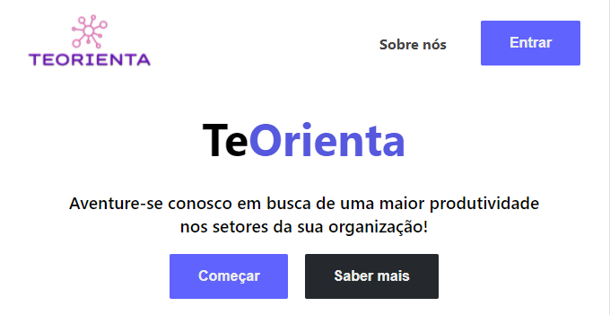
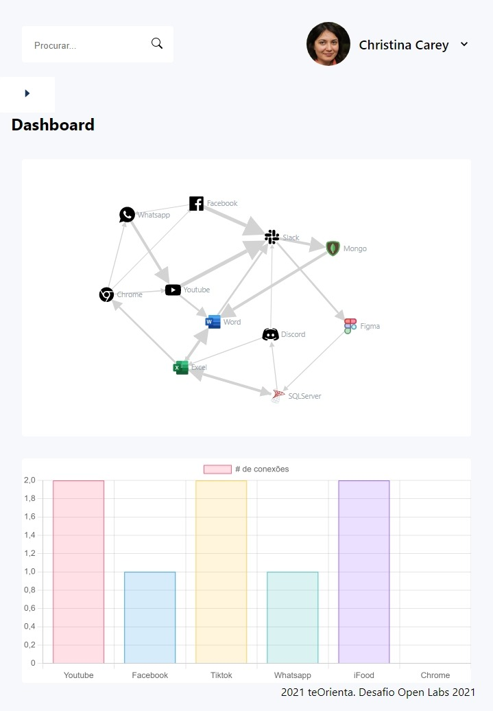

# teOrienta
Projeto para competir no desafio Open Labs 2021

> O Desafio Open Labs é uma atividade no formato HACKATHON, em que estudantes universitários organizados em grupos de 5 ou 6 pessoas criam uma solução para um desafio REAL de uma empresa em até 48 HORAS.

  

A proposta foi desenvolver uma ferramenta visual de mineração de processos para o público em geral.

> O Open Labs 2021 é patrocinado pela Analytics 10 - A10, uma empresa que se dedica à transformação digital dos seus clientes.

  

